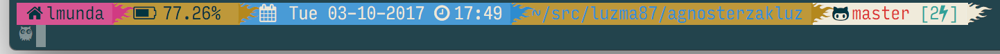

# agnosterzakluz

AgnosterZakLuz is a [oh-my-zsh](https://github.com/robbyrussell/oh-my-zsh) shell theme based on the 
[Powerline Vim plugin](https://github.com/Lokaltog/vim-powerline), 
[Agnoster Theme](https://gist.github.com/agnoster/3712874),
[AgnosterZak Theme](https://github.com/zakaziko99/agnosterzak-ohmyzsh-theme) and
[Oh-my-git prompt](https://github.com/arialdomartini/oh-my-git).

It currently shows:
* Battery Life (currently mac only)
    * indicator of connected or not
    * different colors for 0%-25%, 25%-50%, 50%-75%, 75%-100%
* Date and time
* Current directory
* Git status
    * current branch
    * clean/dirty directory
    * number of changed/added/deleted/modified files
    * number of stashes
* Username

